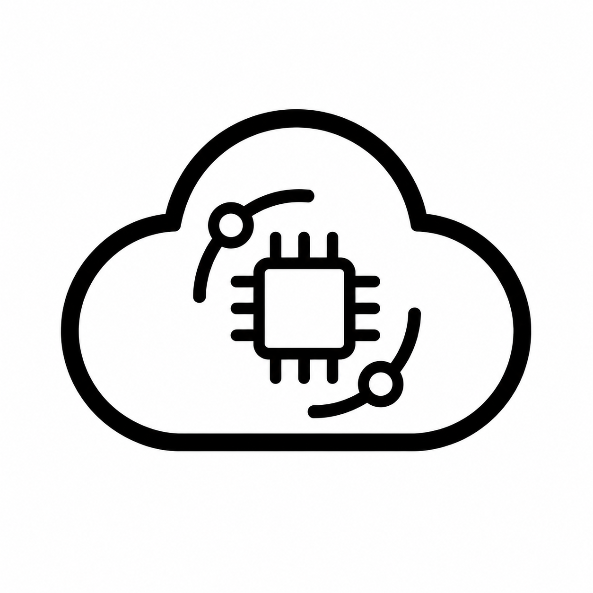

# IoT Dashboard - TB Stack

<p align="center">
  
</p>

<p align="center">
  <strong>Industrial Automation Monitoring & Asset Management Platform</strong>
</p>

## Business Value

A unified platform for monitoring industrial automation systems and managing connected assets, designed to bridge the gap between IoT operations and enterprise business processes.

### What It Does

- **Monitor Automation Systems** - Real-time visibility into device status, connectivity, and performance across your facility
- **Manage Device & Asset Information** - Centralized registry of all IoT devices and physical assets with profile-based organization
- **Enable ERP Integration** - Architecture ready to sync with ERP systems for inventory, maintenance scheduling, and compliance tracking

### Who It's For

- Manufacturing operations teams
- Facility managers
- Industrial automation engineers
- Operations & maintenance departments

## Quick Start

### Dashboard UI
```bash
cd ui
npm install
cp .env.example .env  # Configure NEXT_PUBLIC_API_URL
npm run dev
```

See [ui/README.md](ui/README.md) for detailed technical documentation.

### Firmware
```bash
cd firmware
idf.py menuconfig  # Configure WiFi and API URL
idf.py build flash monitor
```

### Android App
```bash
# Open the android/ folder in Android Studio (Giraffe / Hedgehog or newer, JDK 17+)
# Edit android/.env to point at your ThingsBoard instance:
#   BE_URL=https://demo.thingsboard.io/api
# Then Build → Run on a device or emulator.
```

## Android Companion App

The `/android` directory contains a native Kotlin app that talks to the same ThingsBoard backend as the dashboard UI and lets a phone act as a virtual IoT device for end-to-end testing.

### Goal

Provide a lightweight on-device client to validate the full data pipeline (login → device discovery → MQTT publish) without needing physical hardware.

### What It Does

- **Login** — Authenticates against `${BE_URL}/auth/login`, mirroring [ui/lib/auth.ts](ui/lib/auth.ts); persists the JWT in `SharedPreferences`.
- **Device List** — Fetches `GET /api/tenant/deviceInfos` and lets you pick a target device.
- **MQTT Publish** — Pulls the device's `MQTT_BASIC` credentials (clientId / userName / password), connects to `tcp://<host>:1883`, and publishes random telemetry to topic `v2/t`, equivalent to:

  ```bash
  mosquitto_pub -d -q 1 -h $BE_HOST -p 1883 -t v2/t \
    -i $CLIENT_ID -u $USERNAME -P $PASSWORD \
    -m '{"temperature": 25, "humidity": 100}'
  ```

### Tech Stack

- Kotlin + AppCompat + RecyclerView (no Compose)
- Coroutines + `HttpURLConnection` for REST
- [Eclipse Paho](https://www.eclipse.org/paho/) for MQTT v3

### Configuration

Edit [android/.env](android/.env) — the Gradle build reads it and injects `BuildConfig.API_BASE_URL`:

```dotenv
BE_URL=https://demo.thingsboard.io/api
```

### Project Layout

```
android/
├── .env                          # BE_URL — loaded by Gradle
├── app/
│   ├── build.gradle.kts          # Reads .env, sets buildConfigField
│   └── src/main/
│       ├── AndroidManifest.xml
│       ├── java/com/iot/android/
│       │   ├── MainActivity.kt           # Login screen
│       │   ├── DeviceListActivity.kt     # Device picker
│       │   ├── PublishActivity.kt        # MQTT publish + random data
│       │   └── data/
│       │       ├── ThingsBoardApi.kt     # REST client
│       │       ├── MqttPublisher.kt      # Paho wrapper
│       │       ├── TokenStore.kt         # SharedPreferences token store
│       │       └── Models.kt
│       └── res/layout/
├── gradle/libs.versions.toml
└── settings.gradle.kts
```

### Requirements

- Android Studio Hedgehog (2023.1) or newer
- JDK 17 (AGP 8.8.0 requirement)
- Android SDK 35; minSdk 24

## Firmware Framework

The `/firmware` directory contains an ESP-IDF based framework for connecting ESP32 devices to the IoT Dashboard.

### Goal

Build a reusable, production-ready firmware foundation for ESP-based IoT devices that enables:

- **Plug & Play Connectivity** - Any ESP32/ESP8266 device can connect to the dashboard with minimal configuration
- **Standardized Communication** - HTTP/HTTPS API integration with the ThingsBoard backend
- **Easy Configuration** - WiFi credentials and API endpoints configurable via `menuconfig`
- **Extensible Architecture** - Base framework for adding sensors, actuators, and custom telemetry

### Supported Devices

- ESP32 (all variants)
- ESP32-S2, ESP32-S3, ESP32-C3
- ESP8266 (with modifications)

### Configuration

Edit via `idf.py menuconfig` → IoT Dashboard Configuration:
- WiFi SSID & Password
- API URL endpoint

### Use Cases

- Environmental monitoring (temperature, humidity, air quality)
- Industrial sensor data collection
- Asset tracking and location
- Machine status reporting
- Energy monitoring

## License

MIT
